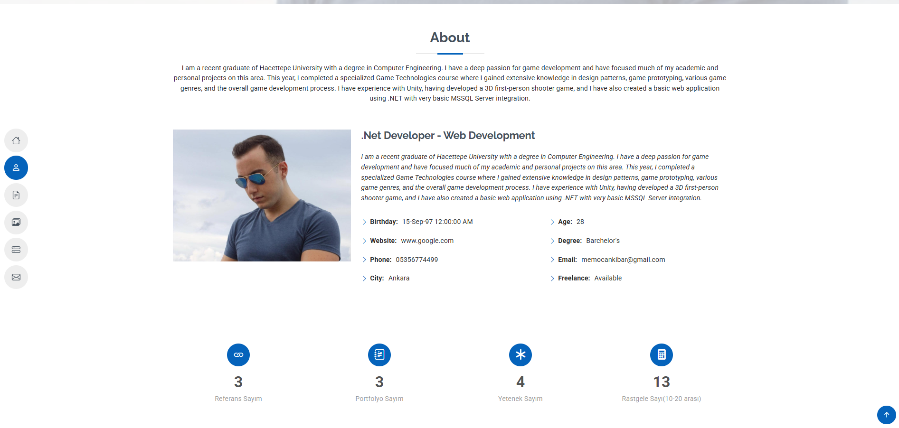
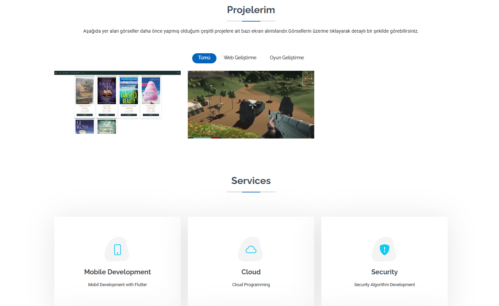
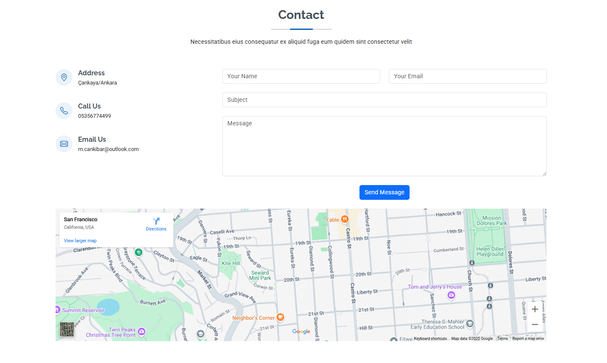
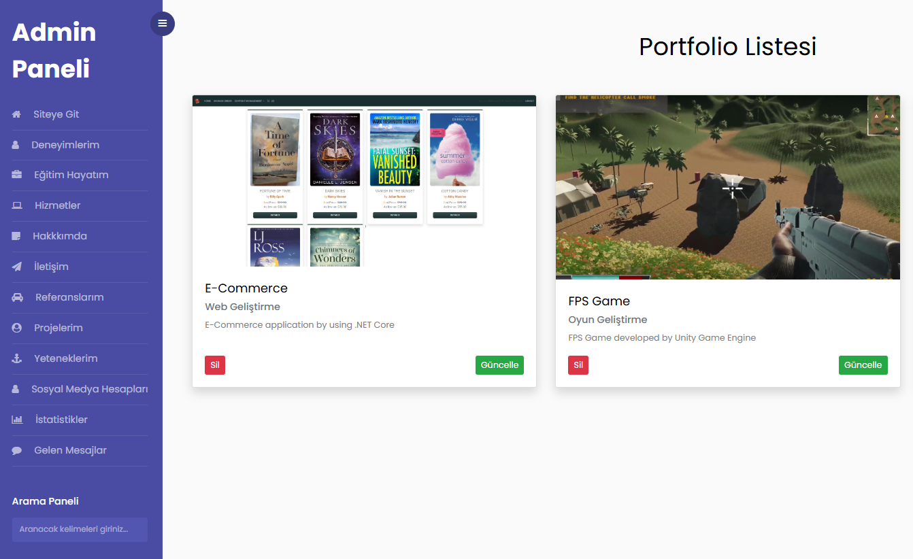
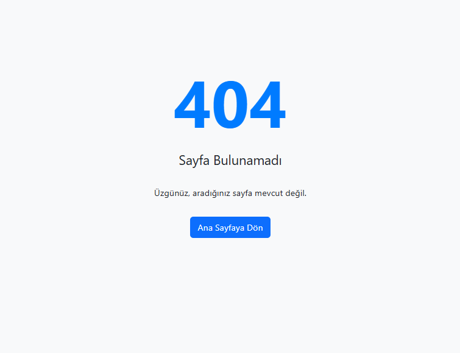

# PortfolioCore Web Application

Bu proje, kişisel portföyünüzü sergileyebileceğiniz, ASP.NET Core MVC mimarisi kullanılarak geliştirilmiş modern bir web uygulamasıdır.  
Yetenekler, deneyimler, projeler ve gelen mesajlar gibi içerikleri kolayca yönetebileceğiniz bir Admin Paneli içermektedir.

## ✨ Özellikler

- Yetenek (Skill) Yönetimi
- Deneyim (Experience) Yönetimi
- Portfolio (Proje) Yönetimi
- Mesaj Gönderimi ve Mesaj Takibi
- Okundu/Bekliyor işaretleme (IsRead toggle)
- Mesaj Silme / CRUD işlemleri
- İstatistik Ekranı
- 404 Hata Sayfası Yönlendirmesi
- Responsive Admin Paneli Tasarımı
- Bootstrap 5 ve modern UI bileşenleri kullanıldı

---

## 📸 Uygulama Görselleri

| Admin Panel Dashboard | Yetenek Listesi | Deneyim Listesi |
|:----------------------:|:---------------:|:---------------:|
|  |  |  |

| Portfolio Listesi | 404 Hata Sayfası |
|:------------------:|:----------------:|
|  |  |

---

## ⚙️ Kullanılan Teknolojiler

- ASP.NET Core MVC
- Entity Framework Core
- SQL Server
- Bootstrap 5
- JavaScript (Fetch API kullanılarak AJAX işlemleri)

---

## 🚀 Başlangıç

Projeyi kendi bilgisayarınızda çalıştırmak için:

1. Bu repoyu klonlayın:
   ```bash
   git clone https://github.com/kullanici-adiniz/PortfolioCore.git
